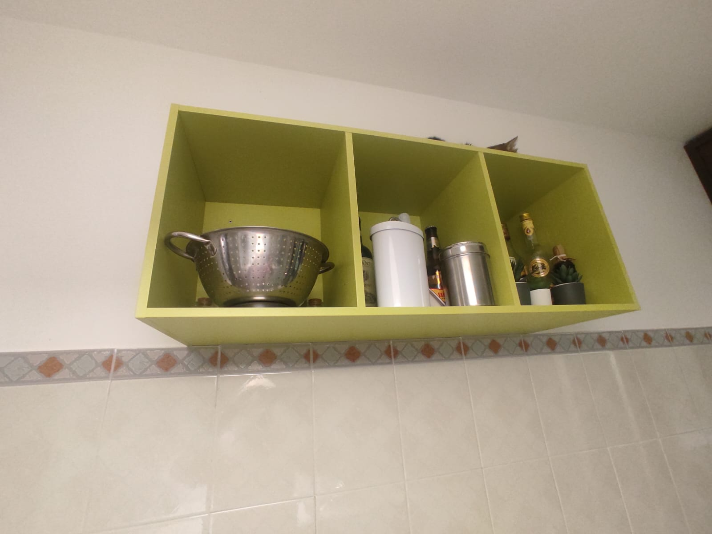
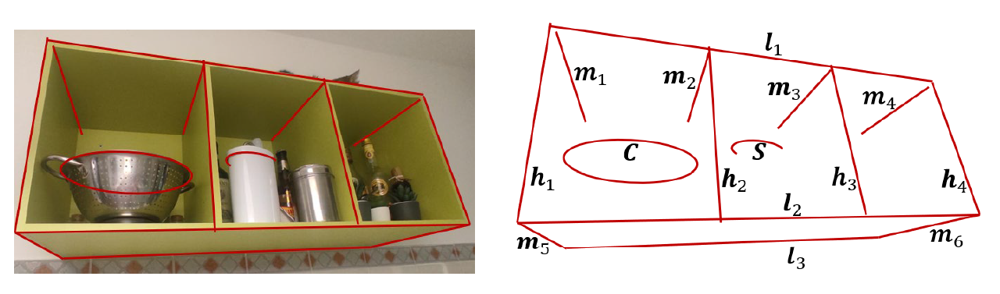

# Image Analysis and Computer Vision - homework

## Description
The homework involves analyzing the provided image and performing a series of operations typical of image analysis and computer vision.

All the problems have to be solved both from the theoretical and practical point of view, explaining in detail the steps taken to reach the solution.

The practical part must be implemented in [Matlab](https://www.mathworks.com/products/matlab.html)

## Task performed

1. **Lines / corners detection**: detect the lines and corners given in the ground truth image:  
2. **Metric rectification**: rectify the image in order to be able to measure the distance between two points
3. **Line measurements**: measure the length of the lines in the image, given the length of one of them
4. **Camera calibration**: calibrate the camera that took the image
5. **3D reconstruction**: reconstruct the 3D scene from the image

## Repository structure

* `elements/`: contains the useful informations extracted or computed from the image
* `functions/`: contains helper matlab functions
* `output/`: contains the outputs of the various tasks, both the images and the data